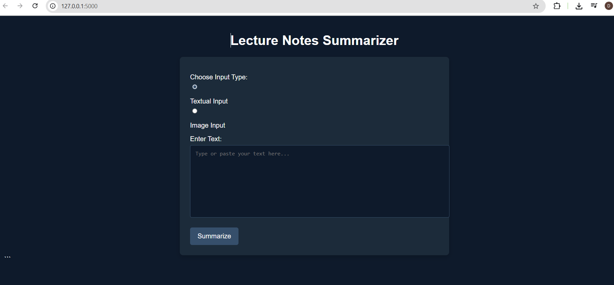

# 📝 Text and Image Summarizer using Flask, Sumy, and Tesseract

This project is a **Flask web application** that allows users to **summarize textual or image-based content** using the **LexRank algorithm from the Sumy library**. It supports:

* Direct text input for summarization
* Image upload with OCR (using Tesseract) for summarization


## 🚀 Features

✅ Summarize **plain text** entered by the user
✅ Summarize **text extracted from images (OCR)**
✅ Uses **LexRank summarizer** for extractive summarization
✅ Built with **Flask + Sumy + Tesseract + OpenCV**
✅ Easy-to-understand, beginner-friendly code

---

## 🛠 Requirements

* Python 3.7+
* Flask
* Flask-Ngrok (for running on Google Colab or local ngrok)
* Sumy
* NLTK
* OpenCV
* Pillow
* Pytesseract
* Tesseract OCR installed on your system (ensure it is in your PATH)

---

## ⚙️ Installation

1️⃣ Clone this repository or copy the files into a folder:

```bash
git clone <repository-link>
cd <project-folder>
```

2️⃣ Install dependencies:

```bash
pip install flask flask-ngrok sumy nltk opencv-python pillow pytesseract
```

3️⃣ Download NLTK punkt tokenizer (if not downloaded automatically):

```python
import nltk
nltk.download('punkt')
```

4️⃣ Ensure **Tesseract OCR** is installed:

* **Windows:** Install from [Tesseract releases](https://github.com/tesseract-ocr/tesseract) and add its path to your environment variables.
* **Linux (Debian/Ubuntu):**

```bash
sudo apt-get install tesseract-ocr
```

---

## 🖥️ Usage

Run the application:

```bash
python app.py
```

If using ngrok or Colab, it will generate a **public URL** for testing.

---

## 🌐 Workflow

1. Go to the homepage (`/`).
2. Choose:

   * **Option 1:** Enter **text** to summarize.
   * **Option 2:** Upload an **image** containing text for OCR + summarization.
3. Submit to generate a **summary of \~5 sentences** using LexRank.
4. View the summary and original input on the summary page.

---

## 🖼️ Demo Screenshot



---

## 📂 File Structure

```
project/
│
├── app.py                  # Main Flask application
├── templates/
│   ├── index.html          # Home page for input
│   └── summary.html        # Displays summary and input
```

---

## 🧩 How It Works

✅ If text input is selected:

* Uses **Sumy + LexRank** on the user input.

✅ If image input is selected:

* Uses **Pytesseract + OpenCV** to extract text from the image.
* Summarizes the extracted text using **LexRank**.

✅ Displays both **input data** and the **generated summary** on the output page.

---

## 🚧 Future Improvements

* Allow adjustable summary length.
* Add support for different summarization algorithms (LSA, TextRank).
* Deploy on Heroku or Render for easy access.
* Add drag-and-drop file upload and progress bars.

---

## 🤝 Contributing

Pull requests and issues are welcome to improve the project and add new summarization methods!


